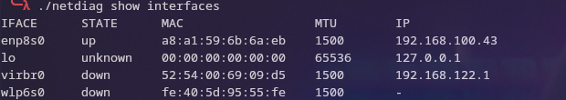
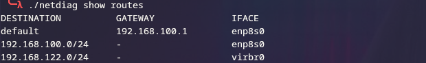
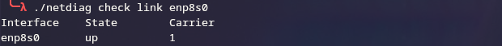
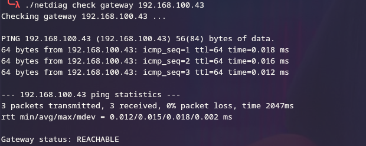
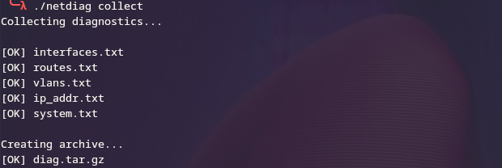

### -Build 

git clone https://github.com/h1dden-pr0cess-cpp/netdiag

cd netdiag

make 

### -Commands 

./netdiag show interfaces

./netdiag show routes 

./netdiag show vlans

./netdiag check link enp8s0

./netdiag check gateway 192.168.100.43

./netdiag collect

### -Examples 

## Interfaces

## Routes

## Vlans

## Link

## Gateway 

## Collect 

